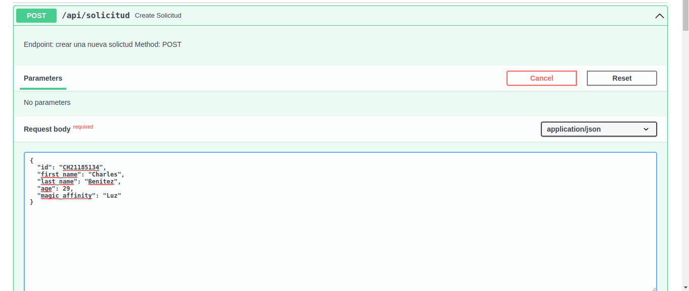

# IA Interactive 

API Rest Desarrollada en FastAPI 


**Intrucciones de instalacion**

1. Clonar el repositorio 
    ```
    git clone https://github.com/
    
    ```

2. Instalar dependecias con virtualenv
    - paso 2.1 crear el entorno virtual
    ```
    python -m virtualenv venv
    ```
    - paso 2.2 activar el entorno virtual
    ```
    source venv/bin/activate
    ```
    
    
    - paso 2.3 actualizar el gestionador de paquetes pip
    ```
    pip install --upgrade pip
    ```
    - paso 2.4 instalar dependecias
    
    ```
    pip install -r requirements.txt
    ```

3. Crear una base de datos y utilizar un .env 
    ```
    mysql+pymysql://<user>:<password>@<host>:<port>/<bd_name>
    ```
    
    **crea un .env para manejar las variables de la BD requeridas**
    user = "charles"
    password = "cjbb1234"
    host = "localhost"
    port = 3306
    bd_name = "academy_magic"


**Ejecucion del proyecto**

1. Activar el servidor local
    ```
    uvicorn main:app --reload
    ```

2. Acceder al swagger u redoc de FastAPI Para probar los endpoints
    - http://127.0.0.1:8000/docs  --> swagger
    - http://127.0.0.1:8000/redoc ---> redoc 


**Endpoints del proyecto**

# 1. /api/solicitud 
    METHOD: POST
    Params: dict -> 
    {  
        "id": "string",
        "first_name": "string",
        "last_name": "string",
        "age": int,
        "magic_affinity": "string"
    }


# 2 /api/get_only_user
    METHOD: GET
    Params: id -> string
    id es un identificador para mostrar la informacion de un registro


# 3 /api/get_users
    METHOD: GET
    Params: empty
    Muestra todos los registros insertados en la BD

 


# 4 /api/get_grimorio
    METHOD: GET
    Params: id -> string
    Utiliza el id de un registro para mostrar el grimorio del usuario

 

# 5. /api/update
    METHOD: PUT
    params : dict -> 
    {
        "id": "string",
        "first_name": "string",
        "last_name": "string",
        "age": 0,
        "magic_affinity": "string"
    }
    Recibe un diccionario con los campos obligatorios para poder actualizar
 


# 6 /api/status
    METHOD: PUT
    Params: id -> string
    Utiliza el id de un registro para actualizar el status de solicitud

 


# 6 /api/delete_student
    METHOD: DELETE
    Params: id -> string
    Utiliza el id de un registro para eliminarlo de la BD

 